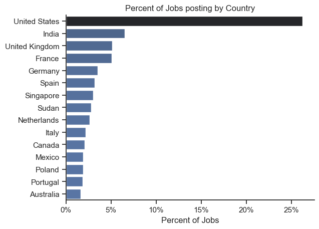
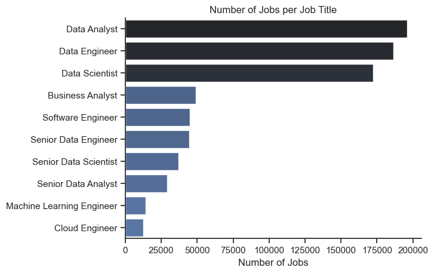
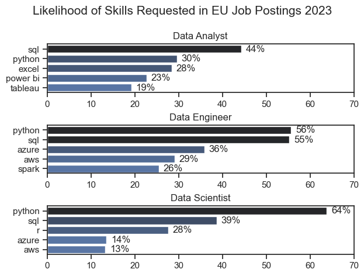
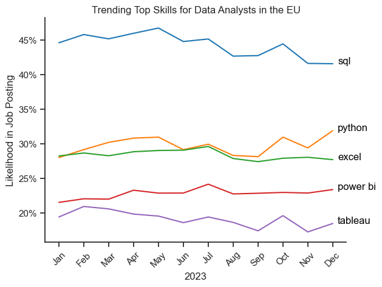
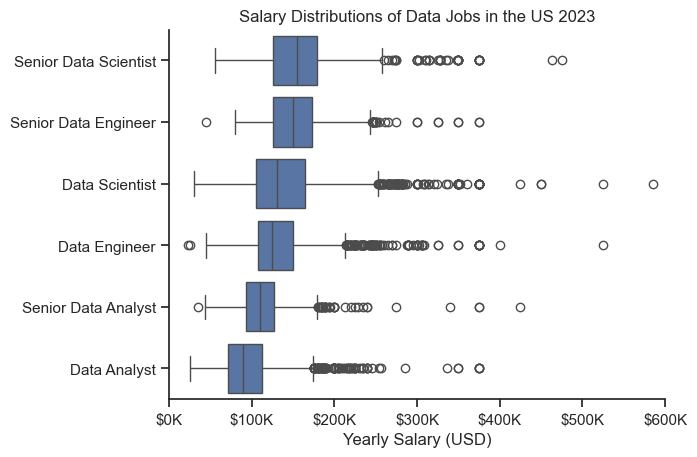
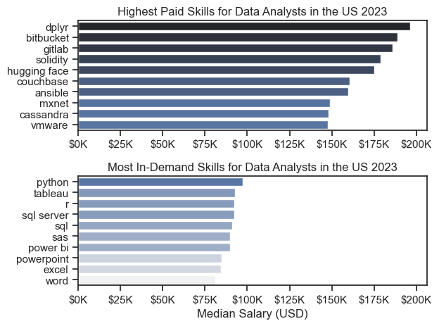
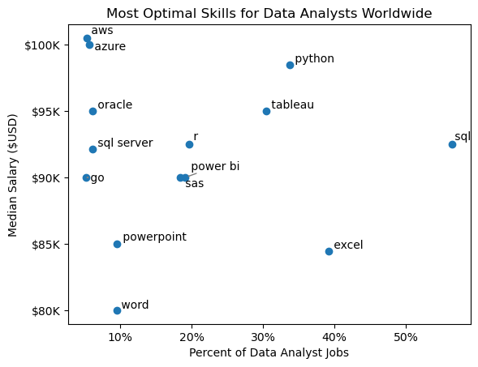
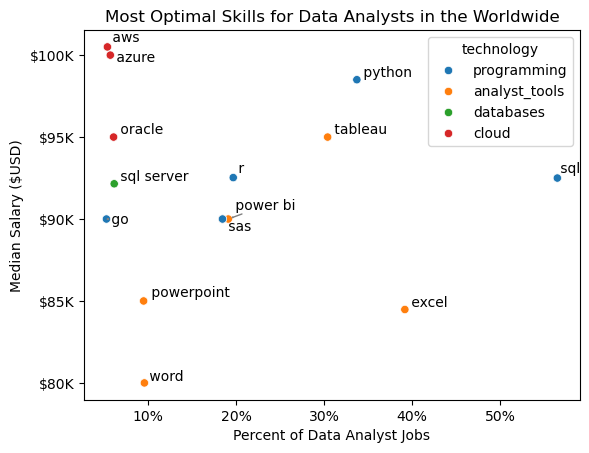

# Overview

Welcome to my analysis of the data job market (2023) 

This project pursues two goals:

1) to help me, as a beginner analyst, understand the market of data‑related job openings, identify the most in‑demand roles, and determine the most optimal skill set for a newcomer;

2) to develop my skills in working with Python, especially with pandas.

I am sincerely grateful to [Luke Barousse's Python Course](https://lukebarousse.com/python) for the dataset and the guides that became the foundation of my work.**
(Despite the fact that the data is somewhat outdated (2023), I still believe it reflects long‑term trends in the labor market for data‑related roles and employer requirements.)

# The Questions

1. What are the skills most in demand for the top 3 most popular data roles?
2. How are in-demand skills trending for Data Analysts?
3. How well do jobs and skills pay for Data Analysts?(Only USA market)
4. What are the optimal skills for data analysts to learn? (High Demand AND High Paying) 


# Tools I Used

    **Python** - (pandas,matplotlib,seaborn)
    **Jupyter Notebooks**
    **VS Code** 
    **Git and GitHub**

# Data Clean Up

Each notebook begins with importing the necessary libraries and performing a small amount of data cleaning. The dataframe itself is of high quality and does not require extensive preprocessing for our analysis.
The first thing I do is convert the 'job_posted_date' column to the datetime format.
The second step concerns the 'job_skills' column, which stores data as a string. To fix this, I use a lambda function together with ast.literal_eval, after which the values are converted into a list.

```python
import ast
import pandas as pd
from datasets import load_dataset
import matplotlib.pyplot as plt
import seaborn as sns

# Loading data
dataset = load_dataset('lukebarousse/data_jobs')
df = dataset['train'].to_pandas()

#Data cleanup 
df['job_posted_date'] = pd.to_datetime(df.job_posted_date)
# Converting job_skills column to list
df['job_skills'] = df['job_skills'].apply(lambda x: ast.literal_eval(x) if pd.notna(x) else x)
```

## Filter  

In my analysis, I apply country‑based filters. In most cases, the data refers to the EU region, but for the salary‑related part of the project I use data from the USA, since it is the most abundant in the dataset.
```python
europe_countries = [
    "Albania", "Andorra", "Austria", "Belgium",
    "Bosnia and Herzegovina", "Bulgaria", "Croatia", "Cyprus",
    "Czech Republic", "Denmark", "Estonia", "Finland", "France",
    "Germany", "Greece", "Hungary", "Iceland", "Ireland",
    "Italy", "Kosovo", "Latvia", "Liechtenstein", "Lithuania",
    "Luxembourg", "Malta", "Moldova", "Monaco", "Montenegro",
    "Netherlands", "North Macedonia", "Norway", "Poland",
    "Portugal", "Romania", "San Marino", "Serbia", "Slovakia",
    "Slovenia", "Spain", "Sweden", "Switzerland", "Ukraine",
    "United Kingdom", "Vatican City"
]
df_eu = df[df['job_country'].isin(europe_countries)]
```
or

```python
df_US = df[(df['job_country'] == 'United States')].dropna(subset=['salary_year_avg'])
```

# The Analysis

First view [EDA Intro](1_EDA_Intro.ipynb)

## Country variety 

The dataset contains more than 700,000 job postings from 160 countries worldwide for the year 2023. A significant share — around 26% — comes from the United States.



## Roles 

The dataset includes 10 different data‑related job titles. In this project, I focus on the three most common roles: Data Analyst, Data Engineer, and Data Scientist. Some positions also appear with a “Senior” prefix. I assume that listings without this prefix are more likely mid‑level roles, so the required skills may not fully reflect expectations for entry‑level candidates.



*I also performed a small analysis focused on Poland, since I currently live here and was personally interested in the local data. If you're interested, feel free to follow this [link](1_EDA_Intro.ipynb#Data_Analysis_for_Data_Analyst_in_Poland)* 

## Answers to key questions
### 1.What are the most demanded skills for the top 3 most popular data roles?

From the three most popular roles identified above, I selected the top five skills for each and filtered them by the number of mentions in job postings. I also converted the values into percentages to make the comparison more intuitive. This is clearly illustrated in the chart below.

View my notebook with detailed steps here: [2_Skills_Count](2_Skills_Count.ipynb).



### Insights:
- Data Analysts most often need SQL (44%), followed by Python (30%) and Excel/BI tools.
- Data Engineers prioritize Python (56%) and SQL (55%), with strong demand for cloud platforms (Azure, AWS) and Spark.
- Data Scientists lean heavily on Python (64%), with SQL (39%) and R (28%) also relevant; cloud skills appear but at lower rates.
- Python is a versatile skill, highly demanded across all three roles.

### 2.How are in-demand skills trending for Data Analysts?
To identify trends, I created a new column representing the month in which each job posting was published. Then, after using the explode method, I built a pivot table where the index corresponds to the month and the columns represent each skills. After that, I converted the counts into percentages to make the trends easier to interpret.

View my notebook with detailed steps here: [3_Skills_Trend](3_Skills_Trend.ipynb).



### Insights:
 - SQL remains the most consistently demanded skill throughout the year, although it shows a gradual decrease in demand.
 - Python and Excel track closely in the mid‑20% to ~30% range, with Python slightly ahead in the end of year
 - Overall: the hierarchy doesn’t change—SQL leads by a wide margin, Python/Excel form the core middle, and BI tools trail behind.

 ### 3. How well do jobs and skills pay for Data Analysts?

 Unfortunately, most salary data is available only for the US region, so the analysis has to be based on US‑specific figures. However, I assume that the overall trends are similar worldwide, with only minor deviations — especially within the EU region.

 View my notebook with detailed steps here: [4_Salary_Analysis](4_Salary_Analysis.ipynb)

 To identify the highest‑paid roles, I used a boxplot. I selected the six most common job titles and filtered the data by salary levels. The resulting distribution can be seen in the chart below

 
/
 ### Insights:
 - Salary ranges vary widely across job titles. Senior Data Scientist roles show the highest earning potential, reaching up to $500K/year. 
 - Data Scientist and  Data Engineer positions also have many high‑end outliers, indicating that exceptional expertise can lead to significantly higher pay. In contrast, Data Analyst salaries are more consistent with fewer extreme values. 
 - Overall, median salaries rise with seniority and specialization, with senior roles showing both higher pay and greater variation.
 - Data Analyst and Senior Data Analyst roles still remain in the lower salary range compared to other positions, which reflects their lower level of expertise and responsibility.

 ### Highest Paid & Most Demanded Skills for Data Analysts
Next, I focused the analysis on identifying the highest‑paying skills based on median salary, as well as determining which of the most common skills have the highest median values.
As a result, I created the following two charts.



- The top chart shows that specialized technical skills like dplyr, Bitbucket, and Gitlab are linked to higher salaries, in some cases reaching $200K.
- The bottom chart highlights that foundational skills such as Excel, PowerPoint, and SQL are the most in‑demand, even if they don’t offer the highest pay.
- Overall, the highest‑paid skills differ from the most in‑demand ones, suggesting that combining widely required core skills with specialized high‑value skills can maximize career growth.

### What are the most optimal skills to learn for Data Analysts?

To answer this question, I  create a scatterplot showing each skill positioned within a coordinate system defined by median salary and the percentage of job postings in which the skill is mentioned.

To avoid overcrowding the chart with too many data points, I decided to filter out skills that appear in less than 5% of all job postings.

View my notebook with detailed steps here: [5_Optimal_Skills](5_Optimal_Skills.ipynb).



#### Insights:
- The skill Azue and Aws appears to have the highest median salary of nearly $100K, despite being less common in job postings. This suggests a high value placed on specialized database skills within the data analyst profession.
- More commonly required skills like Excel and SQL have a large presence in job listings but lower median salaries compared to specialized skills like Python and Tableau, which not only have higher salaries but are also moderately prevalent in job listings.
- Skills such as Python, Tableau are towards the higher end of the salary spectrum while also being fairly common in job listings, indicating that proficiency in these tools can lead to good opportunities in data analytics.

### Visualizing Different Techonologies

Let’s go one step deeper and group the skills by technology categories, which will help us understand which groups provide the most value.




#### Insights:
- Programming skills (Python, SQL, R) sit in the sweet spot — they offer both high demand and strong salaries, making them the core value drivers for data analysts. 
- Cloud skills (AWS, Azure, Oracle) spike higher in salary but appear in fewer job postings, meaning they’re lucrative differentiators rather than essentials. 
- Analyst tools (Excel, Power BI, Tableau) are widely required but don’t boost salary on their own, while basic business tools (Word, PowerPoint) add almost no competitive advantage.

# Insights

This project revealed several key insights about the data job market for analysts:

### Skill Demand and Salary Alignment:  
A strong relationship exists between the demand for specific technical skills and the salaries associated with them. Advanced or specialized capabilities—such as Python programming or cloud platforms like AWS—tend to command higher compensation.

### Evolving Market Trends:  
The demand for particular skills is continually shifting, reflecting the fast‑paced nature of the data industry. Staying current with these trends is crucial for long‑term career development in analytics.

### Economic Value of Skills:  
Recognizing which skills are both highly sought after and well‑paid helps analysts prioritize their learning paths. This strategic approach enables professionals to invest in skills that offer the greatest economic return.

### Limitation
The rapid development of AI technologies is already transforming many areas of our lives. Even while working on this project, I actively used tools like Copilot and ChatGPT. I was also interested in exploring how AI influences salary formation and the value placed on different skills. Recent data shows that many people have lost their jobs due to the rise of these technologies. In the data field, AI has had a particularly strong impact in recent years.
At the same time, it has created new opportunities — from ML‑related roles to jobs in data centers, model training, and data curation. The market is shifting, which means the emergence of new positions as well as the decline of older ones.


```python
# Thank you very much for taking the time to review my 
# project. I wish you and your loved ones 
# good health — take care of yourselves.
```